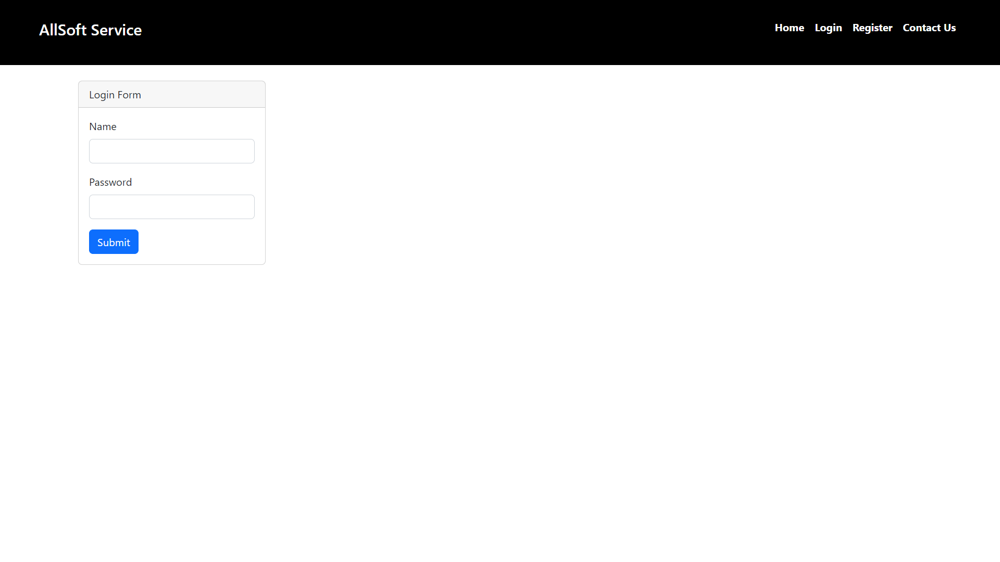
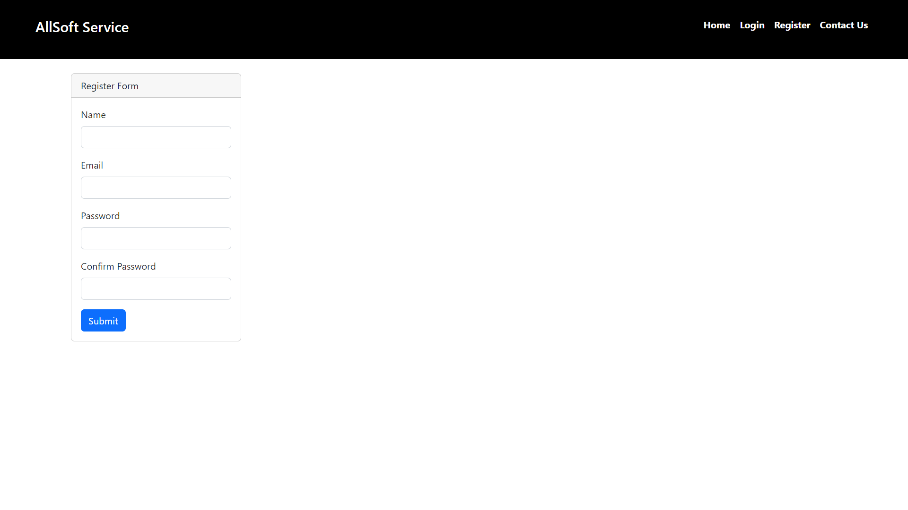
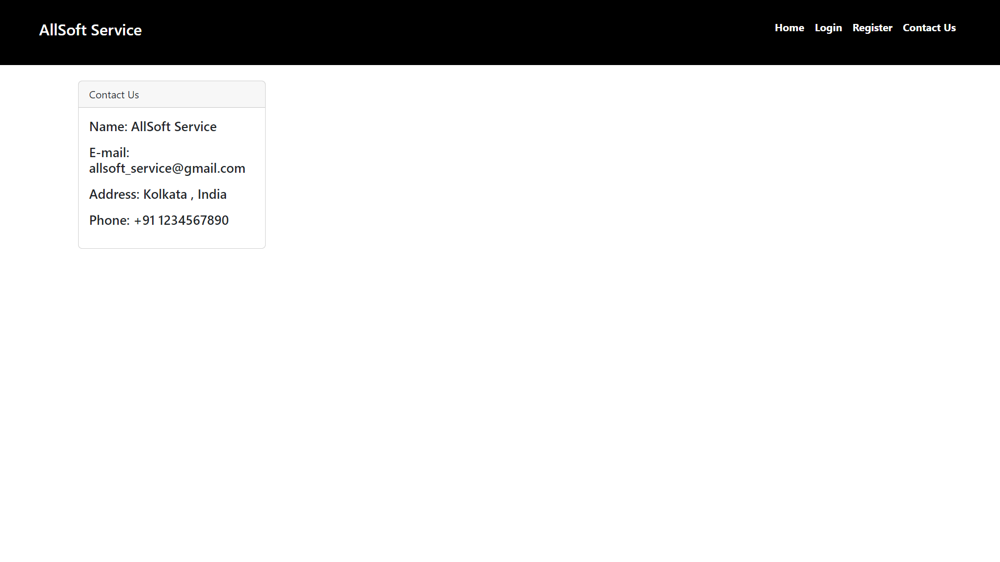
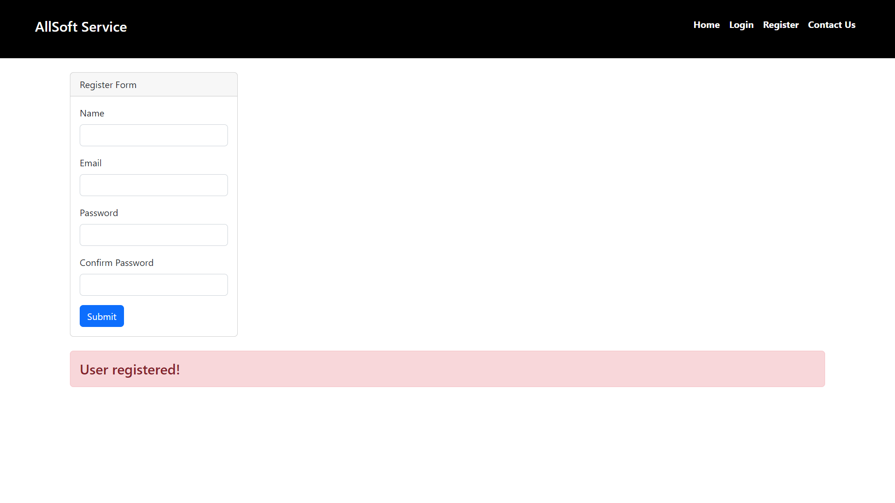

# This is a Software service website Which runs from:-
> Frontend- HTML, CSS, JavaScript
> Backend- NodeJS
> Database- MySQL
# To run this project-
```
git clone
cd Allsoft service
npm install
npm start
```
# output images:






